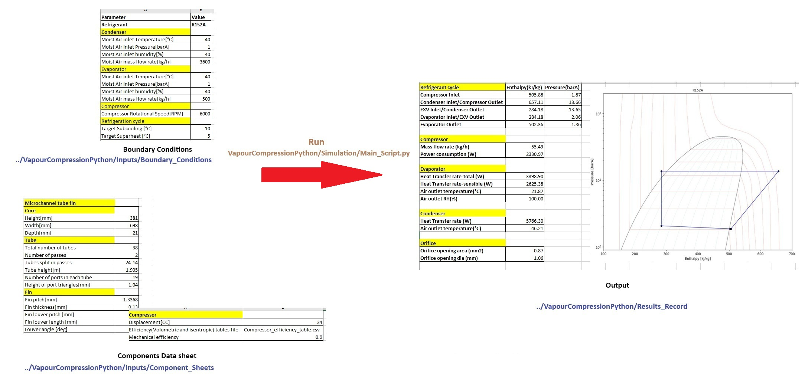

# Steady state simulation of vapour compression cycle

## The project contains a python based tool that simulates a vapour compression cycle based on boundary conditions inputs and component data sheets inputs defined in the form of excel files 

The folders in the project along with their content are briefly explained below
* Inputs folder-Includes Boundary_Conditions subfolder that contains an excel file where the boundary conditions are input and Component_Sheets subfolder where the data for components i.e Compressor , condenser and evaporator are input.
* Refrigerants folder-Includes the data and python file to create ph digram for different refrigerants
* Results_Record folder- Saves the results/output of all simulations run in the form of excel files 
* Simulation folder- Includes python files that contain code to run the simulation
* Template folder-Contains an excel file template that is used for the results/outputs

## Installation of the project
* Clone the repository--> git clone https://github.com/Abhay23/VapourCompressionPython.git
* Change the working directory to repository--> cd path_to_repository
* Install the required libraries--> pip install -r requirements.txt

## Running the tool
* Update the files inside Inputs folder according to the inputs that you want to give
* Run Main_Scripts.py inside simulation folder
* Select the repository folder when prompted

